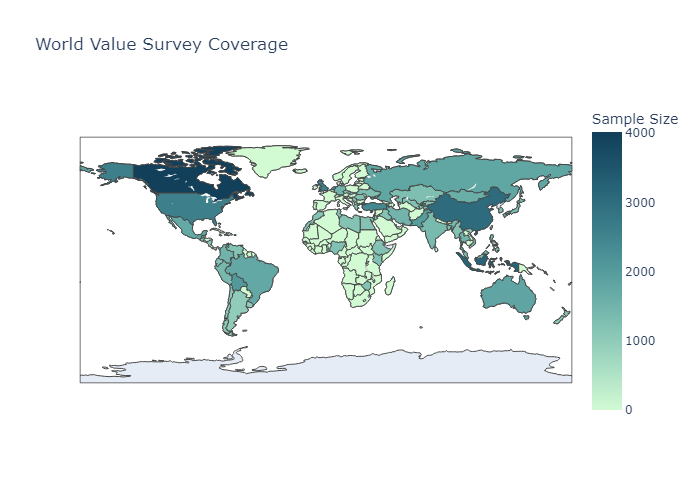

# Model card for World Value Survey data Wordalisation and chatbot

In a nutshell, our app is a retrieval augmented chatbot for making reports about World Value Survey (WVS) data. The app is implemented within the [TwelveGPT Education framework](https://github.com/soccermatics/twelve-gpt-educational) and
is intended as an illustration of the _wordalisation_ method. It is thus intended as an example to help others build similar tools. The wordalisations are constructed using various social metrics derived from data collected in the [World Value Survey](www.worldvaluessurvey.org) (WVS). These social metrics as well as the WVS are discussed in the [Datasets](#datasets) section. This work is a derivative of the full [Twelve GPT product](https://twelve.football). The original design and code for this project was by Matthias Green, David Sumpter and Ágúst Pálmason Morthens, with modification made by Beimnet Zenebe and Amy Rouillard to adapt it to the WVS use-case.

This model card is based on the [model cards paper](https://arxiv.org/abs/1810.03993) and is adapted specifically to Wordalisation applications as detailed in [Representing data in words](publication here). We also provide this model card as an example of good practice for describing wordalisations.

Jump to section:

- [Intended use](#intended-use)
- [Factors](#factors)
- [Datasets](#dataset)
- [Model](#model)
- [Evaluation](#evaluation)
- [Ethical considerations](#ethical-considerations)
- [Caveats and recommendations](#caveats-and-recommendations)

## Intended use

The _primary use case_ of this wordalisation is educational.
It shows how to convert a python pandas DataFrame of statistics about countries into a text that discusses a chosen country. The statistics relate to various social and political values, however we note that the results should be understood in the context of the WVS and the research in which the metrics were derived. The purpose of the wordalisation and chat functionality is to use the capacities of an LLM to make the raw statistics more digestible for a human reader, rather than to investigate the validity of the WVS study.

This chatbot cannot be used for insight generation purposes, i.e. data analysis, firstly because we do not guarantee the quality of the data and because functionality is limited. Data analysis is thus _out of scope_. Use of the chat for queries not relating to the WVS data at hand is also _out of scope_.

We would also strongly oppose the generalization or stereotyping of any group of people and emphasize that this chatbot cannot and should not be used to represent the values any country or its population.

## Factors

The World Value Survey data and derived metrics, discussed in [Datasets](#datasets), relate to 66 countries that took part in the "wave 7" 2017-2022 survey. We would like to state that any conversations about countries not included in the survey are not guaranteed to hold any merit. We also note that the participants of the "wave 7" survey constitute only a small sample of the population of each countries, with the largest sample from a given country being 4000. Therefore, the values presented in the app should not be considered representative of the entire population of any given country.


Figure 1: World Value Survey data collection distribution. The colorscale indicates the number of participants in the survey from each country.



## Datasets

The data used in this project was constructed from the [World Value Survey Wave 7 (2017-2022)](https://www.worldvaluessurvey.org/WVSDocumentationWV7.jsp). The data consists of coded answers to a questionnaire which can be found at the same link. Questionnaires were taken by participants from 66 countries with sample sizes varying from 447 in Northern Ireland to 4018 in Canada. We also not that special status was giving to the regions of Hong Kong, Macao, Puerto Rico and Northern Ireland, which are not independent countries. It is clear from the map below that the data is not evenly distributed across the globe, with coverage in Africa being particularly sparse.


Table 1: Description of metrics
| Metric | Description |
| --- |  --- |
|Traditional vs Secular Values <sup>1</sup>|  Traditional values emphasize religion, family ties, authority, and a nationalistic outlook, rejecting divorce, abortion, euthanasia, and suicide.  Secular-rational values place less emphasis on religion, family authority, and are more accepting of divorce, abortion, and euthanasia. |
|Survival vs Self-expression Values <sup>1</sup> |  Survival values emphasize economic and physical security, with a focus on ethnocentrism and lower levels of trust and tolerance.  Self-expression values prioritize environmental protection, tolerance of diverse groups, gender equality, and political participation.|
|Neutrality <sup>2</sup>| Neutrality measures a lack of engagement in civic, political, or social organizations, with high-scoring countries having little participation in such groups. |
|Fairness <sup>2</sup>| Fairness is measured by attitudes toward whether actions like stealing, bribery, and violence are ever justifiable, reflecting societal values around justice.|
|Skepticism <sup>2</sup>| Skepticism represents distrust in large organizations and institutions, holding them accountable through democratic processes.  A high score in scepticism indicates that a significant portion of the population has low confidence in major institutions such as government and corporations.|
|Societal Tranquility<sup>2</sup> |  Societal Tranquillity measures the level of worry people feel about societal events like war, terrorism, and employment, reflecting a sense of peace and safety.|


From the raw survey data we constructed 6 metrics or _factors_, summerised and described in Table 1. These were calculated according to Ingelhart (2005)[1] and Allison (2021)[2], for metrics indicated by $^1$ and $^2$ respectively. These metrics were derived using factor analysis, which is a statistical method used to describe variability among observed, correlated variables in terms of a potentially lower number of unobserved variables called factors. The metrics are constructed such that they are linear combinations of the observed variables. The weights and questions used to construct these metrics are summerised in Table 2. 

These 6 metrics are intended to aggregate the answers to several survey questions in order to provide a general insight into a country's social values. For example, is a country more traditional or secular? Do they believe the acts like corruption or stealing are ever justifued? How active is the population in civic organizations? However, we point out that the number of questions aggrigated is limited and is debatable whether they can capture the full complexity of a country's values. See [Ethical considerations](#ethical-considerations) for further discussion.


Table 2: Metrics and their construction
| Metric | Questions | Weights | 
| --- | --- | --- | 
|Traditional vs Secular Values | Q164: "How important is God in your life?'." </br> Q8: "How important is independece in children to you?", </br> Q14: "How important is determination perseverance in children to you?" </br> Q15: "How important is religious faith in children to you?" </br> Q17: "How important is obedience in children to you?" </br> Q184: "Abortion. Justifiable?" </br> Q254: "How proud are you to be of the nationality of this country?" </br> Q45: "In the future, would it be a good thing if we had greater respect for authority?" | |
|Survival vs Self-expression Values |Q3: "How important is leisure time to you?" </br> Q5: "How important is work to you?" </br> Q40: "Do you think that work is a duty towards society?" </br> Q41: "Do you think work should always come first, even if it means no spare time?" </br> Q43: "In the future, would it be a good thing if less importance is palced on work" </br> Q131: "Could you tell me how secure do you feel these days in your neighborhood?" </br> Q142: "To what degree are you worried about the following situations? Losing my job or not finding a job" </br> Q150: "Most people consider both freedom and security to be important, but if you had to choose between them, do you think security is more important than freedom" </br> Q46: "Do you feel happy?" </br>    Q49: "How satisfied are you with your life?" </br>    Q22: "Would you mind having people who are homosexuals as neighbors?" </br>   Q182: "Homosexuality. Justifiable?" </br> Q209: "Signing a petition: Now I'd like you to look at this card. I'm going to read out some different forms of political action that people can take, and I'd like you to tell me, for each one, whether you have actually done any of these things, whether you might do it or would never, under any circumstances, do it: Signing a petition." </br> Q218 : "Signing an electronic petition: Now I'd like you to look at this card. I'm going to read out some other forms of political action that people can take using Internet and social media tools like Facebook, Twitter etc., and I'd like you to tell me, for each one, whether you have done any of these things, whether you might do it or would never under any circumstances do it: Signing an electronic petition." </br> Q57: "Most people can be trusted" </br>    Q58: "How much do you trust your family?" </br>    Q59: "How much do you trust your neighborhood?" </br>    Q60: "How much do you trust people you know personally?" </br>    Q61: "How much do you trust people you meet for the first time?" </br>    Q62: "How much do you trust people of another religion?" </br>    Q63: "How much do you trust people of another nationality?"|
|Neutrality | Q102R: "Are you a member of a consumer organization?" </br> Q101R: "Are you a member of a charitable or humanitarian organization?" </br> Q100R: "Are you a member of a professional organization?" </br> Q103R: "Are you a member of a self-help or mutual aid group?" |
|Fairness |Q179: "Stealing property. Justifiable?" </br> Q181: "Someone accepting a bribe in the course of their duties. Justifiable?" </br> Q180: "Cheating on taxes if you have a chance. Justifiable?" </br> Q191: "Violence against other people. Justifiable?" </br> Q189 : "For a man to beat his wife. Justifiable?"|| Fairness is measured by attitudes toward whether actions like stealing, bribery, and violence are ever justifiable, reflecting societal values around justice.|
|Skepticism |Q73: "How much confidence do you have in the parliament?" </br> Q71: "How much confidence do you have in the government?" </br> Q74: "How much confidence do you have in the civil services"  </br> Q72: "How much confidence do you have in political parties? </br> Q70: "How much confidence do you have in the justice system/courts?"|
|Societal Tranquility | Q148: "To what degree are you worried about the following situations? A civil war" </br> Q147: "To what degree are you worried about the following situations? A terrorist attack" </br> Q146: "To what degree are you worried about the following situations? A war involving my country" </br> Q143: "To what degree are you worried about the following situations? Not being able to give one's children a good education" |


We note that because of the coding of answers to the questionnaire some considerable _preprocessing_ was necessary to construct these metrics. Our preprocessing pipeline is available as a [python notebook](), and the relevant data should be downloaded from the [official WVS site](https://www.worldvaluessurvey.org/WVSDocumentationWV7.jsp). 


In addition to the wordalisation of these metrics we provide question and answer pairs to the chatbot. The first set of question and answer pairs were contrusted from the texts [1] and [2] as well as the World Value Survey website [3]. They are intended to contextualize the data and metrics and can be found in the [WVS Qualities](https://github.com/soccermatics/twelve-gpt-educational/blob/wvs_chat/data/describe/WVS_qualities.xlsx) spreadsheet. The descriptions provided in Table 1 are extracted from this spreadsheet. 

In addition, we provide question and answer pairs that are intend to provide good examples of how that chat bot should discuss the chosen country. These in-context-learning examples and can be found [here](https://github.com/soccermatics/twelve-gpt-educational/blob/wvs_chat/data/gpt_examples/WVS_examples.xlsx). The usage of the above mentioned question-answer pairs is detailed in the [Normative model](#normative-model) section.

## Model

### Quantitative model

The model applies a mapping to the countries in the dataset along different value scales, see Table 2. For each metric, a z-score is calculated by subtracting the mean and dividing by the standard deviation over all countries' metric values in the dataset. The countries are then displayed in a distribution plot with the selected country highlighted, representing leaning on different value scales.

### Normative model

A prompt is constructed in several parts (_tell it who it is_, _tell it what it knows_, _tell it how to answer_, _tell it what data to use_) in order to provide relevant context to the LLM. The prompt to _tell it who it is_ identifies a human role for the chatbot as a "Data Analyst". The user-assistant pairs in the stage of _tell it what it knows_ describe the general context of the chat domain and how the selected values can be [interpretted in the social sciences](https://github.com/soccermatics/twelve-gpt-educational/blob/wvs_chat/data/describe/WVS_qualities.xlsx) according to [1] and [2]. These descriptions outline the meaning of the values. And the penultimate prompt to _tell it how to answer_ provides [examples of expected outputs](https://github.com/soccermatics/twelve-gpt-educational/blob/wvs_chat/data/gpt_examples/WVS_examples.xlsx) given data about a certain country. The final prompt is to _tell it what data to use_ and is therefore customised for the selected country.

At the stage of _tell it what data to use_, we apply a model that maps the z-scores for each metric associated with the selected country onto different value scales. The distribution of countries along the value scale represents the leaning of values towards one value or the other. For example, a country with a z-score of more than 3 on the traditional vs secular values metric would be considered to "have extremely secular values". We would like to note that z-score values are devoid of any notion of ranking of country values as better or worse. In other words, we do not consider that any particular result to be more or less favourable in a moral sense.

We use the following function to translate z-scores into evaluation words:

```python
def describe(thresholds, words, value):
    assert len(words) == len(thresholds) + 1, "Issue with thresholds and words"
    i = 0
    while i < len(thresholds) and value < thresholds[i]:
        i += 1

    return words[i]
```

We then provide different sets of words and thresholds to use for each metric being discussed. For example, for "Traditional vs Secular Values" we might use the following:

```python
thresholds = [2.5, 1.5, 0.5, -0.5, -1.5, -2.5]
words = [
        "have extremely secular values",
        "have very secular values",
        "have above averagely secular values",
        "have neither strongly traditional nor strongly secular values",
        "have above averagely traditional values",
        "have very traditional values",
        "have extremely traditional values"
    ]
```

which fits into the template:

```python
text = f"{country.name.capitalize()} was found to {words} compared to other countries in the same survey. "

```

### Language model

Our implementation supports both GPT4o and ChatGPT and related APIs, as well as Gemini API. Since these language model's training data included text about these countries, this knowledge will likely effect both the initial response and subsequent queries within the same chat. This means that some aspects of the answers may come from data external to that in the provided dataframe. 

## Evaluation

**Under construction**

Some systematic _quantitative analyses_ has been carried out on this wordalisation.

- Sentiment analysis. How does the prompt and wordalisation affect the sentiment of the chatbot when discussing a country?

Ideally, this wordalisation should be subjected to further rigorous _qualitative test_ of:

- Reliability of information. Are there factual errors in the text?
- Biases
  - Does the WVS chatbot make bias statements based on 'knowledge' not present in the wordalisation?
  - Does the wordalisation relay on socitial stereotypes of countries to generate the texts?
  - Does the wordalisation introduce notions of ranking to countries' values.

## Ethical considerations

The World Value Survey is based on questionnaires filled out by a small sample of individuals from different countries around the world. In particular, we used data from the 7th wave of the survey which took place from 2017-2022. Samples are relatively small compared to the populations of the countries, see Figure 1. While data was collected from 66 countries, the data is not evenly distributed across the globe, with coverage in Africa being particularly sparse. Special status was also given to the regions of Hong Kong, Macao, Puerto Rico and Northern Ireland, which are not independent countries.

While some effort was made to accomodate multiple lanuages, questionnaires where provided in a limited number of languages for each country, possibly preventing some groups of the population from participating. The data is also based on self-reported answers to the questionnaires, which may be influenced by the social context in which the questionnaire was given.

In the context of the factors mentioned the above, the data can only give a rough indication of the attitudes of a population, during the period 2017-2022. Therefore, the summaries generated by the [Normative model](#normative-model) may contain out of date information and should not be considered a reflection of the beliefs or attitudes of any given individual.

We also would like to note that it is an open question as to whether the derived metrics summerised in Tables 1 and 2 give any meaningful insights and we would urge users to consider them within the research context in which they were derived, see [1] and [2] and the World Value Survey website [3].

## Caveats and recommendations

We have no further caveats and recommendations.

## References

[1] Ingelhart, R. and Welzel, C., 2005. Modernization, cultural change, and democracy: The human development sequence.

[2] Allison, L., Wang, C. and Kaminsky, J., 2021. Religiosity, neutrality, fairness, skepticism, and societal tranquility: A data science analysis of the World Values Survey. Plos one, 16(1), p.e0245231.

[3] “WVS Database.” Accessed October 23, 2024. https://www.worldvaluessurvey.org/wvs.jsp.
